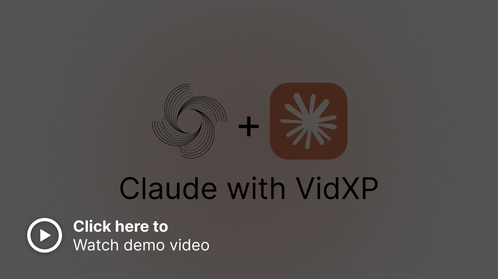

<p align="center">
  <a href="https://github.com/grayhatdevelopers/vidxp">
    
  </a>
</p>

<h1 align="center">VidXP</h1>

<p align="center">
  <em>Search video by what was said, what appeared on screen, and recurring faces.</em>
</p>

<p align="center">
  A local-first video search engine for people, applications, and AI agents.
</p>

<p align="center">
  <strong>Dialogue search · Scene search · Actor grouping</strong>
</p>

<p align="center">
  <a href="https://github.com/grayhatdevelopers/vidxp/releases/latest">
    
  </a>
</p>

<p align="center">
  Windows · Apple Silicon macOS · Linux
</p>

<p align="center">
  <a href="https://pypi.org/project/vidxp/"></a>
  <a href="https://github.com/grayhatdevelopers/vidxp/pkgs/container/vidxp"></a>
  <a href="LICENSE"></a>
  <a href="https://grayhat.studio/discord"></a>
</p>

## Find the moment, not the timestamp

VidXP makes one video—or an entire collection—searchable by meaning:

- **Dialogue search:** type what you remember someone saying and jump to the
  matching moments.
- **Scene search:** describe what appeared on screen and find the closest
  visual matches.
- **Actor matching:** find recurring faces within a video and export a
  highlighted video for a selected group.

Use it to search years of family videos, add video search to an editing
workflow, or let an AI agent answer questions using evidence from your own
video library. Your videos can stay on your machine.

[](https://www.linkedin.com/feed/update/urn:li:activity:7343569473720725505/)

## Start here

Choose the setup that fits how you want to use VidXP.

### 1. CLI and MCP

For direct use, scripts, and local AI agents, install
[uv](https://docs.astral.sh/uv/getting-started/installation/), then run:

```bash
# Install the CPU edition
uv tool install --python 3.14 --torch-backend cpu "vidxp[local-worker,mcp]"

# Set up FFmpeg
vidxp init

# Download search models
vidxp prepare

# Check everything
vidxp doctor

# Connect an MCP client
vidxp mcp-config
```

Add the browser interface with:

```bash
uv tool install --python 3.14 --torch-backend cpu \
  "vidxp[local-worker,mcp,frontend]"
vidxp ui
```

See the [installation guide](INSTALLATION_GUIDE.md) for client-specific MCP
configuration, the HTTP API, and remote server setup.

### 2. Desktop app

Download the installer for Windows, Apple Silicon macOS, or Linux from
[GitHub Releases](https://github.com/grayhatdevelopers/vidxp/releases).

Connect an existing VidXP installation or let the desktop app manage an isolated
runtime for you. See the [desktop guide](docs/desktop.md) for supported setup
options.

### 3. Docker for a server

Run the published all-in-one image on a home server or another single machine:

```bash
docker run --rm --init \
  -p 8501:8501 \
  -v vidxp-data:/var/lib/vidxp \
  ghcr.io/grayhatdevelopers/vidxp:latest
```

For a long-lived server, pin a published version instead of `latest`. For a
Coolify deployment, use the published `-control` and `-worker` images with
[`compose.coolify.yaml`](compose.coolify.yaml)—no repository build is required.
See the [Coolify guide](docs/deployment/coolify.md) for the complete setup.

## What you can do today

- Build searchable libraries from individual videos or whole collections.
- Find dialogue by meaning and visual moments by describing the scene.
- Ask grounded questions and inspect the supporting boards, frames, or clips.
- Group recurring faces and render highlighted actor overlays.
- Keep personal, client, or project libraries separate.
- Use VidXP through the desktop app, browser, CLI, MCP, or HTTP API.

## A first search

The browser app guides you through importing and indexing. The same flow from
the command line is:

```bash
# Add a video
vidxp media import samplevideo.mp4 --json

# Index the returned media ID
vidxp index create <media-id>

# Find a visual moment
vidxp search scene "a yellow taxi on a city street"

# Find something that was said
vidxp search dialogue "the bread just came out of the oven"
```

Results include the source video, timestamps, match score, and the evidence
used to find the moment. Add `--media-id <media-id>` to search only one video.

Run `vidxp --help` or `vidxp <command> --help` for the full command reference.

## For applications and AI agents

Use the Python package to add selected VidXP capabilities directly to an
application, or use the HTTP API when VidXP runs as a service.

[](https://youtu.be/fa4Zx-bSOh4)

MCP lets AI clients add and index videos, search dialogue and scenes, ask
questions about a library, and return inspectable evidence such as boards,
frames, and clips. Clients can connect locally over stdio or to a self-hosted
VidXP server.

### ChatGPT and Codex skills

VidXP includes reusable skill source folders for the two common agent workflows:

- [Ingest and index videos](skills/vidxp-ingest-video/SKILL.md)
- [Find moments and return inspectable evidence](skills/vidxp-find-video-evidence/SKILL.md)

Download a skill folder and add it through a supported ChatGPT desktop or Codex
Skills surface. The skills require a connected VidXP MCP server; installable
plugin packaging for additional ChatGPT surfaces will follow separately.

- [Python, HTTP, and MCP installation](INSTALLATION_GUIDE.md)
- [Optional capability packages](INSTALLATION_GUIDE.md#optional-dependency-extras)
- [Coolify server setup](docs/deployment/coolify.md)

## Downloads and storage

First setup downloads only the models needed for the capabilities you select.
VidXP shows the download size and destination before it starts.

The Desktop-managed Python runtime and its selected dependencies can use
approximately 3 GiB.

| Capability | Approximate model download |
|---|---:|
| Dialogue search | 2.64 GiB |
| Scene search | 1.43 GiB |
| Actor matching | 37 MiB |

A full local Desktop setup with every search capability uses approximately
7.1 GiB. Leave additional temporary space during installation and for indexes,
source videos, and exported results.

By default, the CLI and desktop app share the same VidXP data directory:

| Platform | Default location |
|---|---|
| Windows | `%LOCALAPPDATA%\VidXP` |
| macOS | `~/Library/Application Support/VidXP` |
| Linux | `${XDG_DATA_HOME:-~/.local/share}/VidXP` |

Docker keeps the same data in the `vidxp-data` volume shown above.

## Product roadmap

The next product improvements are focused on:

- labeling actor groups and matching the same person across different videos;
- more reliable face tracking across angle, lighting, motion, and occlusion;
- connecting visible people with the dialogue they are speaking;
- better search ranking, time ranges, and natural-language questions across a
  whole library;
- richer previews, timelines, filters, saved searches, and result playback;
- easier organization for large personal and project video collections;
- faster indexing and supported GPU acceleration; and
- smoother desktop updates, repair, and model management.

VidXP is in beta. Feedback about search quality, actor workflows, and real
video-library use cases is especially useful.

## Help and project links

- [Installation and troubleshooting](INSTALLATION_GUIDE.md)
- [Desktop application](docs/desktop.md)
- [Coolify deployment](docs/deployment/coolify.md)
- [Changelog](CHANGELOG.md)
- [Issue tracker](https://github.com/grayhatdevelopers/vidxp/issues)
- [MIT license](LICENSE)

## Contributing

Contributions are welcome. Read the
[contribution guide](docs/CONTRIBUTING.md) before opening a pull request.

## Credits

Built by Grayhat Developers PVT Ltd. and maintained by the community.
Originally researched by students:
- [Abdullah Mansoor](https://github.com/abdullahmansoor321)
- [Muhammad Haroon](https://github.com/haroon10725)
- [Sarah Jawaid](https://github.com/sarr266)
- [Talha Ahmed](https://github.com/talhaahmed1234)

Working with [Dr Shahab Tahzeeb](https://scholar.google.com/citations?user=cryeRB0AAAAJ&hl=en) ([NED University of Engineering and Technology](https://www.neduet.edu.pk/)) and [Saad Bazaz](https://scholar.google.com/citations?user=mrJo09oAAAAJ&hl=en) ([Grayhat](https://grayhat.studio)).

Email: info@grayhat.studio

<a href="https://github.com/grayhatdevelopers/vidxp/graphs/contributors">
  
</a>
